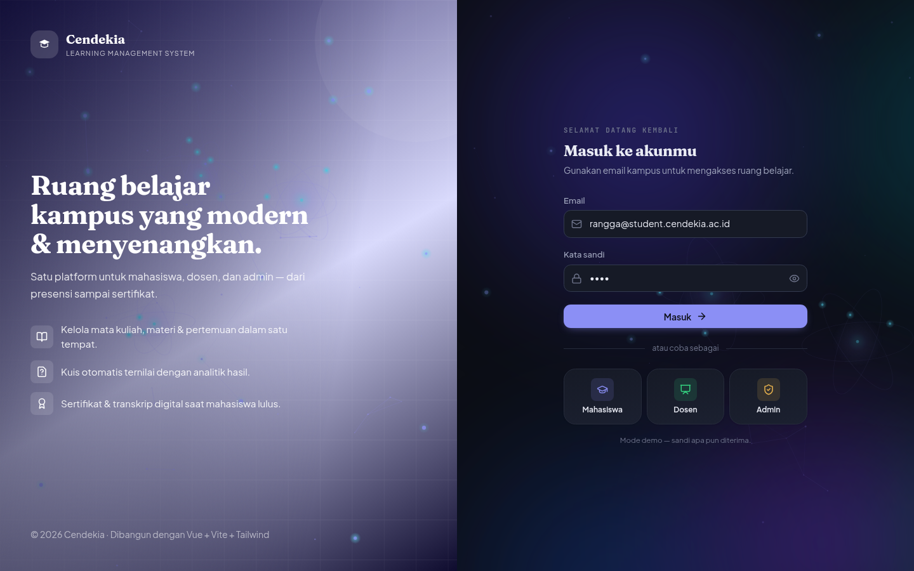
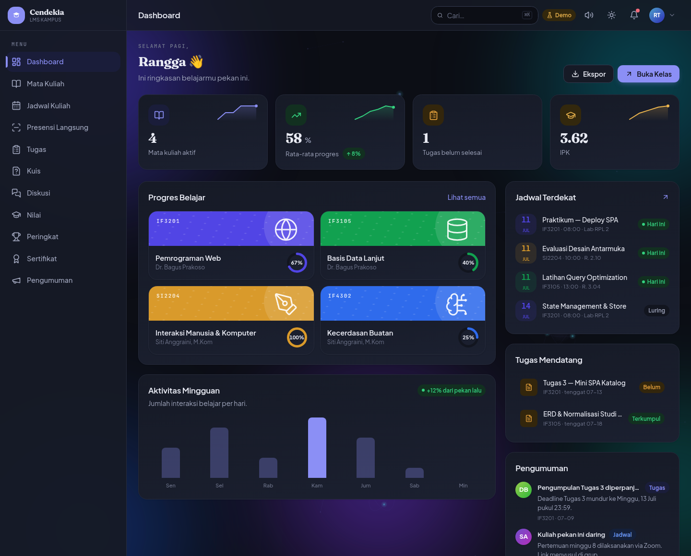
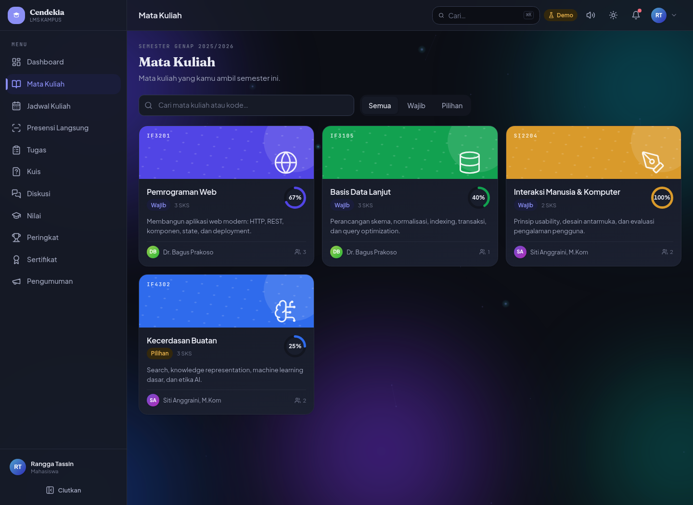
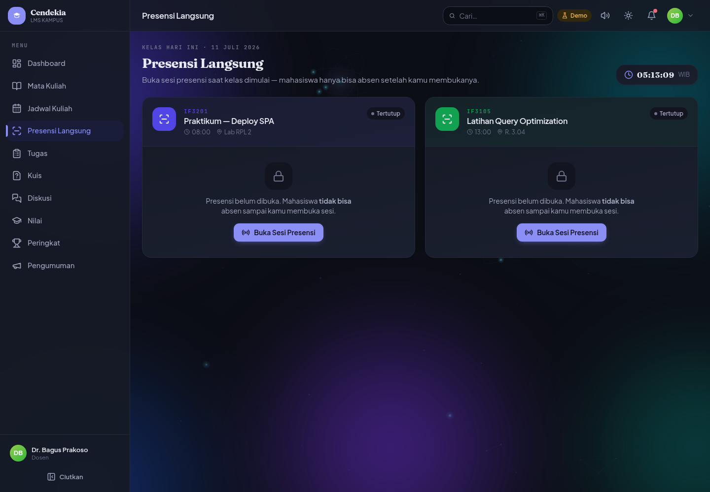
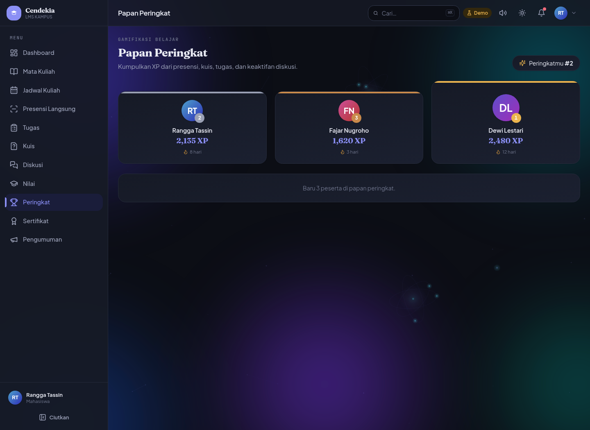
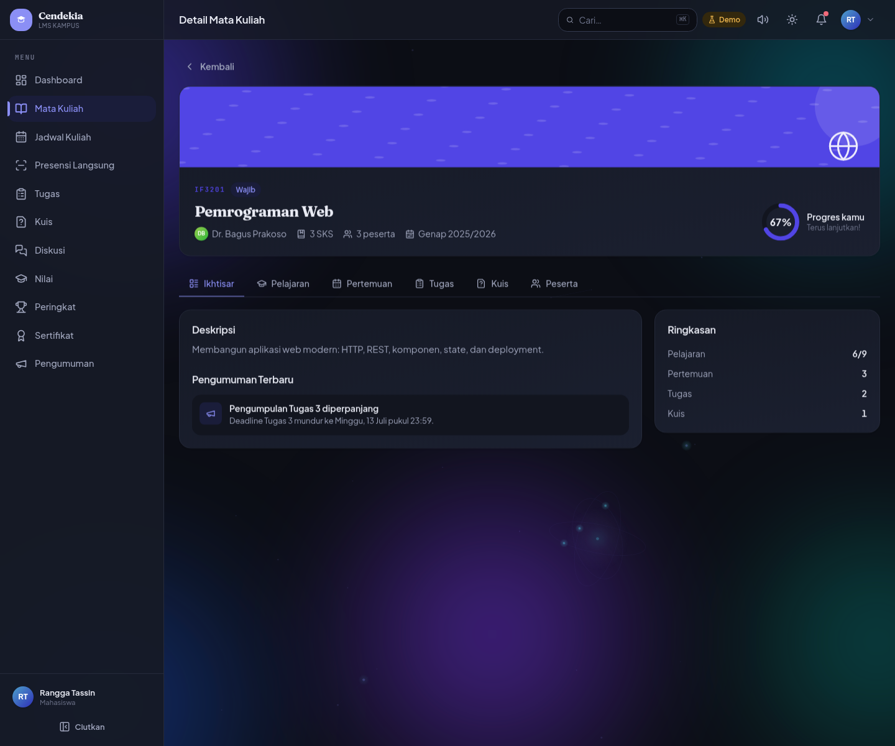

<div align="center">



# 📚 Cendekia LMS

### Learning Management System Kampus — Interaktif, Gamified, & Modern

[](https://lms.learningsystem.my.id)


</div>

---

## 📖 Tentang

**Cendekia LMS** adalah Learning Management System (LMS) untuk perguruan tinggi yang berfokus pada **pengalaman belajar yang interaktif dan menyenangkan**. Materi terstruktur *Bab → Pelajaran* dengan progres otomatis, kuis ber-*auto-grade*, presensi langsung real-time, forum diskusi, hingga sistem **gamifikasi** (XP, streak, badge, papan peringkat) untuk memacu motivasi mahasiswa.

Dibangun untuk tiga peran (**Mahasiswa**, **Dosen**, **Admin**), setiap peran memiliki dashboard dan alur kerja sendiri — dari mengelola kelas & menilai tugas, hingga belajar dan mengumpulkan sertifikat.

> 🌐 **Live:** [lms.learningsystem.my.id](https://lms.learningsystem.my.id)

---

## ✨ Fitur Utama

- 🔐 **Multi-peran** — Mahasiswa, Dosen, dan Admin dengan dashboard & hak akses berbeda.
- 📘 **Mata Kuliah + Detail Lengkap** — struktur *Bab → Pelajaran* dengan tanda selesai, **progres diturunkan otomatis** dari pelajaran yang dirampungkan; tab Ikhtisar/Pelajaran/Pertemuan/Tugas/Kuis/Peserta.
- 📡 **Presensi Langsung (Real-time)** — dosen membuka sesi & kode presensi, mahasiswa *check-in* langsung; jam real-time & auto-refresh.
- 📝 **Kuis + Quiz Player** — *auto-grade* untuk pilihan ganda, penilaian manual untuk esai, dengan batas nilai lulus.
- 📤 **Tugas** — pengumpulan & penilaian tugas oleh dosen.
- 💬 **Forum Diskusi** — diskusi per mata kuliah dengan balasan berjenjang.
- 🏆 **Gamifikasi & Peringkat** — XP, streak, badge, dan papan peringkat antar mahasiswa.
- 📜 **Sertifikat Digital** — sertifikat penyelesaian yang dapat dilihat & dibagikan.
- 💯 **Nilai / KHS** — rekap nilai per mata kuliah & indeks prestasi.
- 🗓️ **Jadwal Kuliah** — jadwal terstruktur dengan pengingat kelas terdekat.
- 📣 **Pengumuman** — linimasa pengumuman kelas & kampus.
- 🗂️ **Manajemen Pengguna (Admin)** — kelola akun mahasiswa & dosen.
- 🔊 **Umpan Balik Kaya** — notifikasi *toast* & *sound engine* yang bisa dimatikan.
- 🌗 **Mode Gelap & Terang** — desain iris-indigo dengan *aurora background* yang berbeda mood tiap tema.

---

## 🛠️ Tech Stack

| Kategori | Teknologi |
|----------|-----------|
| Framework | **Vue 3** (Composition API, `<script setup>`) |
| Build Tool | **Vite 7** |
| Styling | **Tailwind CSS v4** (design tokens via `@theme`) |
| State | **Pinia** |
| Routing | **Vue Router 4** |
| Ikon | **lucide-vue-next** |
| Font | Plus Jakarta Sans · Fraunces · JetBrains Mono (bundled lokal) |
| Deploy | **Cloudflare Pages** |

---

## 🚀 Instalasi & Menjalankan

```bash
# 1. Clone repositori
git clone https://github.com/Kstriabintang/cendekia-lms.git
cd cendekia-lms

# 2. Install dependency
npm install

# 3. Jalankan mode development
npm run dev          # buka http://localhost:5173

# 4. Build untuk produksi
npm run build        # hasil di folder dist/
npm run preview      # pratinjau hasil build
```

> **Catatan data:** aplikasi berjalan penuh dengan *mock backend* (in-memory + `localStorage`) tanpa konfigurasi. Untuk menyambungkan **Supabase**, isi `.env` (lihat `.env.example`) dan buat `src/services/supabaseBackend.js` dengan nama method yang sama — tanpa mengubah komponen.

---

## 👤 Akun Demo

Mode demo — **sandi apa pun diterima**, dan tersedia tombol **masuk cepat** di halaman login.

| Role | Username | Password |
|------|----------|----------|
| Admin | `admin@cendekia.ac.id` | `demo1234` |
| Dosen | `bagus@cendekia.ac.id` | `demo1234` |
| Mahasiswa | `rangga@student.cendekia.ac.id` | `demo1234` |

---

## 📸 Tampilan

### Halaman Masuk


### Dashboard Mahasiswa


### Katalog Mata Kuliah


### Presensi Langsung (Dosen)


### Papan Peringkat (Gamifikasi)


### Detail Mata Kuliah


---

## 📄 Lisensi

Dirilis di bawah lisensi **MIT** — lihat berkas [LICENSE](LICENSE).

<div align="center">

Dibuat dengan ❤️ oleh **Ksatria Bintang Samudra**

</div>
